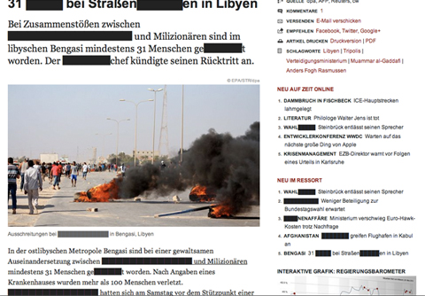

Mathias Lam: Rausch(en)
==

###Abstract

Rausch(en)

Durch neue Medien gibt es eine stetig zunehmende Menge an Informationen, die für immer mehr Menschen ortsunabhängig zugänglich sind. Trotz der breiten Zugänglichkeit sind diese Informationen nicht vor Zensur geschützt.
Zensur besitzt verschiedene Dimensionen: Selbstzensur und (staatlich/gesellschaftliche) gelenkte Zensur. Diese Manipulation von Informationen hat den Effekt, die Wirkllichkeit zu verdrehen und damit eine neue "Wirklichkeit" zu erschaffen. 
Der Ablauf ist prozesshaft: Zensur hat keinen eindeutigen Startpunkt und ebenso kein Ende. Der Prozess der Zensur kommt daher einem Rausch gleich. Einerseits rauschhaften Forderungen nach immer mehr, andererseits dem rauschhaften Vergessen von dem "Davor". In diesem Prozess, der die neu geschaffene "Wirklichkeit" formt, besteht die Gefahr, die Zensur zu akzeptieren - der Mensch verliert sich in diesem neuen System, richtet sich ein und verstärkt den Prozess durch angepasste Forderungen. 

Rausch(en) ist ein Experiment und findet in einer Ausstellung statt.
In einem weiß gestrichen Raum befinden sich drei Module die zusammen ein System bilden:

######Modul 1: N-DI
Das erste Modul trägt den Namen N-DI und besteht aus einem Monitor und einem Eingabegerät. Der Nutzer trägt die zu zensierenden Wörter in die Datenbank ein.
Der Inhalt der Datenbank ist beliebig erweiterbar, gespeicherte Daten können jedoch nicht mehr gelöscht werden.

######Modul 2: N-DO
Das zweite Modul trägt den Namen N-DO und besteht aus einer Informationsdatenbank (RSS-Feeds von Nachrichtendienste) und einem Drucker. Neue Informationen werden unmittelbar nach dem Erscheinen ausgedruckt.

######Modul 3: N-CNS
Das dritte Modul trägt den Namen N-CNS und besteht aus einer computergestützten numerischen Steuerung an der ein schwarzer Stift befestigt ist. Dieses Modul befindet sich hinter dem N-DO und zensiert die ausgedruckten Informationen mit den aus dem N-DI eingespeisten Daten. Ein Eingriff in diesen Vorgang ist nicht möglich.
 
Nachem der Prozess des Zensierens des N-CNS beendet ist, werden die zensierten Informationen an die Wand gehängt. Das Publikum kann somit einerseits das Ergebnis des Systemablaufs verstehen und andererseits den Prozess der Zensur nachvollziehen.

###Skizze

###Datenquelle

Die Datenquelle besteht aus einem RSS-Feed verschiedener Nachrichtendienste und der Datenbank, welche im Laufe des Experiments entseht.

  



