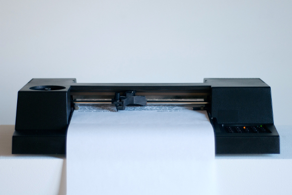
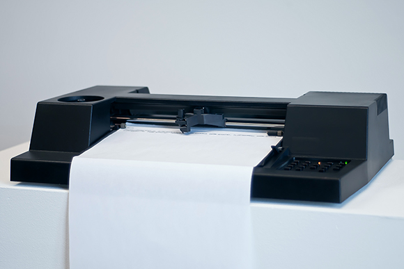
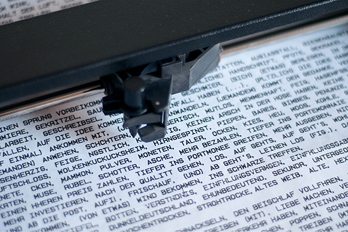

## information
* Title: Instanz-Apparat
* Category: Semesterarbeit
* Student: Mathias Lam
* University: Hochschule für Künste Bremen
* Course Title: Schaubilder: Fabrizierte Information 
* Lecturer/s: Dennis Paul
* Year: SS 2013


## text + images
### deutsch 


Freud hat ein Strukturmodell der Psyche entwickelt. Dieses besteht aus drei Instanzen: dem Es, dem Ich und dem Über-Ich. Der Instanzapparat gibt dieses Strukturmodell in Form eines Experiments wieder. Er besteht aus drei Modulen, die jeweils die Eigenschaften einer Instanz wiedergeben und zusammen ein System bilden.


######Modul 1: M-SE (SUPER-EGO)
Das erste Modul trägt den Namen **M-SE** und besteht aus einem Monitor, einem Eingabegerät und einer Datenbank. Der Nutzer trägt die zu zensierenden Wörter in die Datenbank ein.
Bei der initialen Einstellung des Wortes in die Datenbank wird es für einen bestimmten Zeitraum gespeichert. Für jedes weitere Eingeben desselben Wortest, wird diese Dauer erweitert.
Durch das Eingeben eines Wortes mit dem voran gestellten Befehl "/del" verkürzt sich die Speicherdauer.

######Modul 2: M-ID (ID)
Das zweite Modul trägt den Namen **M-ID** und besteht aus einer Wörterdatenbank. Per Zufall wird ein Wort unter 100.000 ausgewählt und anschließend Assoziationen und Synonyme ermittelt. Diese Informationen werden an das Modul 3 weitergeleitet.

######Modul 3: M-E (EGO)
Das dritte Modul trägt den Namen **M-E** und besteht aus einer computergestützten, numerischen Steuerung, an der ein schwarzer Stift befestigt ist. Dieses Modul druckt zunächst die von dem **M-ID** erhaltenen Wörter aus und zensiert die ausgedruckten Informationen entsprechend den aus dem **M-SE** eingespeisten Daten. Ein Eingriff in diesen Vorgang ist nicht möglich.
 


### english
( no english version )